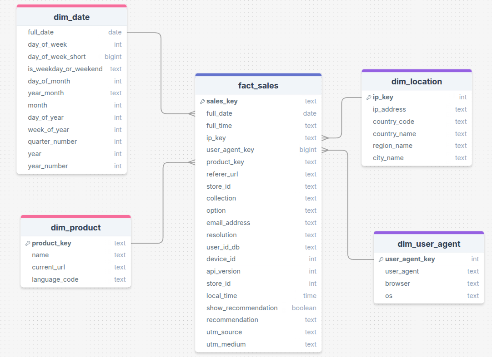
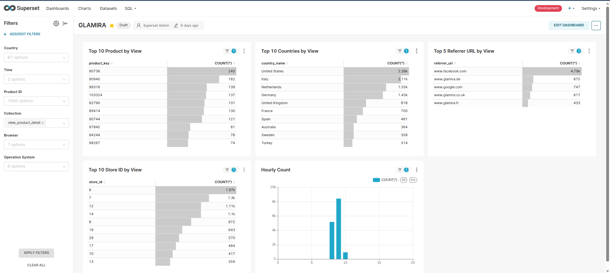

# Real-time Data Streaming Pipeline: Kafka → Spark → PostgreSQL

## 📋 Project Overview

This project implements a real-time data streaming pipeline that processes user behavior data from a website. The system streams data from Apache Kafka topics through Apache Spark for processing and transformation, then persists the results in a PostgreSQL database for analytics and reporting.

**Data Flow Architecture:**
```
User Behavior Data → Kafka Topic → Spark Streaming → Data Processing & Transformation → PostgreSQL Database → Analytics Reports
```

## 🎯 Project Objectives

**Input Sources:**
- **Kafka**: Remote Kafka cluster with SASL authentication containing product view data
- **Spark**: Apache Spark cluster for real-time stream processing
- **Raw Data**: JSON-formatted user interaction events from web applications

**Output Deliverables:**
- Star schema database design optimized for analytics
- Production-ready streaming pipeline code
- Real-time data processing with duplicate handling
- Comprehensive analytics reports and dashboards
- Scalable PostgreSQL data warehouse

## 🏗️ System Architecture

### Core Components
- **Data Ingestion**: Apache Kafka for reliable message streaming
- **Stream Processing**: Apache Spark for real-time data transformation
- **Data Storage**: PostgreSQL with star schema design
- **Configuration Management**: INI-based configuration system
- **Logging & Monitoring**: Comprehensive logging with error handling
- **Containerization**: Docker-based deployment for consistency

### Processing Modes
- **foreachPartition**: Optimized for high throughput parallel processing
- **foreachBatch**: Better for complex transformations and debugging

### 📁 Project Structure
```
Le_Son_LV2_Project_02/
├── README.md                    # Project documentation
├── requirements.txt             # Python dependencies
├── data_model.png              # Database schema diagram
├── streaming_pipeline/         # Core pipeline modules
│   ├── config.ini              # Configuration settings
│   ├── pipeline.py             # Main streaming pipeline logic
│   ├── run_pipeline.py         # Pipeline execution entry point
│   ├── utils.py                # Utility functions and UDFs
│   ├── db_connector.py         # Database connection management
│   └── config.py               # Configuration parser
├── notebooks/                  # Jupyter notebooks for testing
└── logs/                      # Application logs
```

## 🗄️ Database Design

### Star Schema Architecture


#### 📊 Fact Table: `fact_sales`
Central fact table storing user interaction events with foreign keys to dimension tables.

| Column | Type | Description |
|--------|------|-------------|
| **sales_key** | String (PK) | SHA2-256 hash of (id + product_key) |
| **full_date** | String (FK) | Date from timestamp (yyyy-MM-dd) |
| **full_time** | String | Time from timestamp (HH:mm:ss) |
| **ip_key** | String (FK) | SHA2-256 hash of IP address |
| **user_agent_key** | String (FK) | SHA2-256 hash of user agent |
| **product_key** | String (FK) | Product identifier |
| **referrer_url** | String | Cleaned referrer domain |
| **collection** | String | Event type (e.g., view_product_detail) |
| **option** | JSON | Product options as JSON string |
| **email_address** | String | User email (optional) |
| **resolution** | String | Device resolution (e.g., 1920x1080) |
| **user_id_db** | String | Database user ID (optional) |
| **device_id** | String | Anonymous device identifier |
| **api_version** | String | API version used |
| **store_id** | String | Store/market identifier |
| **local_time** | String | Local timestamp (yyyy-MM-dd HH:mm:ss) |
| **show_recommendation** | String | Whether recommendation was shown |
| **recommendation** | String | Recommended products |
| **utm_source** | String | UTM campaign source |
| **utm_medium** | String | UTM campaign medium |

#### 📅 Dimension Table: `dim_date`
Time dimension for temporal analysis and reporting.

| Column | Type | Description |
|--------|------|-------------|
| **full_date** | String (PK) | Date in yyyy-MM-dd format |
| **day_of_week** | Integer | Day of week (1-7, Monday=1) |
| **day_of_week_short** | String | Short day name (Mon, Tue, etc.) |
| **is_weekday_or_weekend** | String | 'Weekday' or 'Weekend' |
| **day_of_month** | Integer | Day of month (1-31) |
| **year_month** | String | Year-month in yyyy-MM format |
| **month** | Integer | Month number (1-12) |
| **day_of_year** | Integer | Day of year (1-366) |
| **week_of_year** | Integer | Week number (1-53) |
| **quarter_number** | Integer | Quarter (1-4) |
| **year** | Integer | Year (e.g., 2024) |

#### 🛍️ Dimension Table: `dim_product`
Product catalog for product-related analytics.

| Column | Type | Description |
|--------|------|-------------|
| **product_key** | String (PK) | Product identifier |
| **name** | String | Product name |
| **current_url** | String | Product page URL |
| **language_code** | String | Language code (en, nl, etc.) |

#### 🌍 Dimension Table: `dim_location`
Geographic dimension for location-based analysis.

| Column | Type | Description |
|--------|------|-------------|
| **ip_key** | String (PK) | SHA2-256 hash of IP address |
| **ip_address** | String | Original IP address |
| **country_code** | String | Country code (US, NL, etc.) |
| **country_name** | String | Country name |
| **region_name** | String | Region/state name |
| **city_name** | String | City name |

#### 🖥️ Dimension Table: `dim_user_agent`
User agent dimension for device and browser analytics.

| Column | Type | Description |
|--------|------|-------------|
| **user_agent_key** | String (PK) | SHA2-256 hash of user agent |
| **user_agent** | String | Full user agent string |
| **browser** | String | Extracted browser name |
| **os** | String | Extracted operating system |

## 🚀 Quick Start Guide

### Prerequisites Checklist

#### 1. Docker Environment
```bash
# Check Docker installation
docker --version
docker-compose --version

# Verify Docker daemon is running
docker ps
```

#### 2. Network Setup
```bash
# Create Docker network for services communication
docker network create streaming-network

# Verify network exists
docker network ls | grep streaming-network
```

#### 3. Required Services & Configuration

Make sure all required services are running and properly configured. Check your `streaming_pipeline/config.ini` file and modify the connection settings as needed for your environment.

**Required services:**
- **Remote Kafka cluster** with SASL authentication and `product_view` topic
- **PostgreSQL database** (local or containerized)
- **Docker network** for service communication

Verify all services are accessible, ensure Kafka topics exist, and review the configuration sections in `streaming_pipeline/config.ini` to match your setup.

### 🔧 Pipeline Execution

#### Option 1: Docker Deployment (Recommended)
-  Prerequisites: Make sure you are in the Le_Son_LV2_Project_02 directory
```bash
cd /path/to/Data-Engineering-Journey/Le_Son_LV2_Project_02
```

- **Quick Health Check** (Optional but recommended):
```bash
# Make script executable (first time only)
chmod +x check_kafka_health.sh

# Check Kafka servers connectivity before deployment
./check_kafka_health.sh
```

- **Deploy using script** (Recommended):
```bash
# Make script executable (first time only)
chmod +x deploy.sh

# Run deployment
./deploy.sh
```

- **Manual Deploy** (Alternative):
```bash
(zip -r streaming_modules.zip streaming_pipeline/*) &&
docker container stop spark-streaming || true &&
docker container rm spark-streaming || true &&
docker run -ti --name spark-streaming \
--network=streaming-network \
-p 4041:4040 \
-v ./:/spark \
-v spark_lib:/opt/bitnami/spark/.ivy2 \
-v spark_data:/data \
-e PYSPARK_DRIVER_PYTHON='python' \
-e PYSPARK_PYTHON='./environment/bin/python' \
unigap/spark:3.5 bash -c "
python -m venv pyspark_venv &&
source pyspark_venv/bin/activate &&
pip install -r /spark/requirements.txt &&
pip install venv-pack &&
venv-pack -o pyspark_venv.tar.gz &&
spark-submit \
  --packages org.apache.spark:spark-sql-kafka-0-10_2.12:3.5.1,org.postgresql:postgresql:42.7.3 \
  --archives pyspark_venv.tar.gz#environment \
  --py-files /spark/streaming_modules.zip \
  /spark/streaming_pipeline/run_pipeline.py"
```

#### Option 2: Local Development

```bash
# Install Python dependencies
cd Le_Son_LV2_Project_02
pip install -r requirements.txt

# Run warmup pipeline (initialize database)
python streaming_pipeline/run_pipeline.py  # Set warmup flag to True in the file first

# Run streaming pipeline
python streaming_pipeline/run_pipeline.py  # Set streaming flag to True in the file
```

### 📊 Monitoring & Validation

#### 1. Spark UI Access
- **URL**: http://localhost:4040
- **Monitor**: Job progress, stages, executors, and streaming metrics

#### 2. Database Validation
```sql
-- Check table creation
SELECT tablename FROM pg_tables WHERE schemaname = 'public';

-- Verify data ingestion
SELECT COUNT(*) FROM fact_sales;
SELECT COUNT(*) FROM dim_product;
SELECT COUNT(*) FROM dim_location;
SELECT COUNT(*) FROM dim_user_agent;
SELECT COUNT(*) FROM dim_date;

-- Sample data validation
SELECT * FROM fact_sales LIMIT 5;
```

#### 3. Pipeline Health Checks
```bash
# Check container logs
docker logs spark-streaming --tail 100

# Monitor Kafka topic consumption (Remote Kafka with SASL authentication)
# Note: This requires proper SASL configuration for the remote Kafka cluster
kafka-console-consumer.sh \
  --topic product_view \
  --bootstrap-server kafka-server1:9094,kafka-server2:9094,kafka-server3:9094 \
  --consumer-property security.protocol=SASL_PLAINTEXT \
  --consumer-property sasl.mechanism=PLAIN \
  --consumer-property 'sasl.jaas.config=org.apache.kafka.common.security.plain.PlainLoginModule required username="your_username" password="your_password";' \
  --from-beginning

# Verify PostgreSQL connectivity
docker exec -it postgres-container psql -U your_username -d your_database -c "SELECT version();"
```

## 🛠️ Development & Testing

### Local Development Setup
```bash
# Clone repository
git clone <repository-url>
cd Data-Engineering-Journey/Le_Son_LV2_Project_02

# Set up Python environment
python -m venv venv
source venv/bin/activate  # On Windows: venv\Scripts\activate
pip install -r requirements.txt

# Configure development settings
cp streaming_pipeline/config.ini.example streaming_pipeline/config.ini
# Edit streaming_pipeline/config.ini with your local settings
```

### Testing Pipeline Components
```bash
# Test individual components
cd notebooks/
jupyter notebook test_connection.ipynb

# Run unit tests (if available)
python -m pytest tests/

# Manual testing with sample data
python -c "
import sys
sys.path.append('/path/to/Le_Son_LV2_Project_02')
from streaming_pipeline.pipeline import StreamingPipeline
pipeline = StreamingPipeline(test_mode=True)
# Add test code here
"
```

## 📈 Analytics Reports

The pipeline supports the following analytics queries:

1. **Top 10 Products by Views (Current Day)**
2. **Top 10 Countries by Views (Current Day)**  
3. **Top 5 Referrer URLs by Views (Current Day)**
4. **Store Performance by Country (Ranked by Views)**
5. **Hourly View Distribution by Product (Current Day)**
6. **Hourly Browser/OS Analytics (Current Day)**

### 📊 Sample Analytics Dashboard

Below is a sample dashboard showing various analytics reports and visualizations generated from the streaming data:



## 🔧 Configuration Management

### Environment-Specific Settings
- **Development**: `streaming_pipeline/config.ini` with remote Kafka/local database settings
- **Docker**: Configured for container networking with remote Kafka
- **Production**: Environment variables override

### Key Configuration Sections
```ini
[local_spark]
app_name = YourStreamingApp

[docker_postgres]
host_in = db
host_out = localhost
database = your_database
user = your_username
password = your_password
port_in = 5432
port_out = 5433

[remote_kafka]
kafka.bootstrap.servers = kafka-server1:9094,kafka-server2:9094,kafka-server3:9094
kafka.security.protocol = SASL_PLAINTEXT
kafka.sasl.mechanism = PLAIN
kafka.sasl.jaas.config = org.apache.kafka.common.security.plain.PlainLoginModule required username="your_username" password="your_password";
subscribe = product_view
startingOffsets = latest
```


## 📚 Dependencies

### Python Requirements
```txt
pandas==2.0.3
numpy==1.24.3
sqlalchemy==2.0.19
psycopg2-binary==2.9.7
user-agents==2.2.0
```

### Spark Packages
- `org.apache.spark:spark-sql-kafka-0-10_2.12:3.5.1`
- `org.postgresql:postgresql:42.7.3`

## 🤝 Contributing

1. Fork the repository
2. Create a feature branch: `git checkout -b feature-name`
3. Commit changes: `git commit -am 'Add feature'`
4. Push to branch: `git push origin feature-name`
5. Submit a Pull Request

## 📄 License

This project is part of a data engineering course and is for educational purposes.

## 🔗 References

- [Apache Spark Python Package Management](https://spark.apache.org/docs/latest/api/python/user_guide/python_packaging.html)
- [Spark JDBC Data Sources](https://spark.apache.org/docs/latest/sql-data-sources-jdbc.html)
- [Apache Kafka Documentation](https://kafka.apache.org/documentation/)
- [PostgreSQL Docker Official Images](https://hub.docker.com/_/postgres)

---
**📧 For questions or support, please refer to the course materials or contact the instructor.**