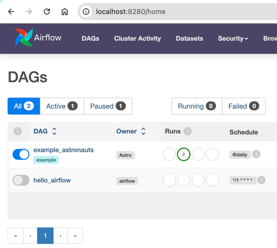

## Overview

This guide explains how to create and run a simple DAG on `airflow`.

## 1. Add the .py file to the `dags` directory

Copy the `hello_airflow.py` file to the `dags` directory in the `airflow` installation you set up.

## 2. Enable the DAG in the UI

After adding the `.py` file to the `dags` directory, open the Airflow UI and you will see that `hello_airflow` has been
added to the list of DAGs.

Next, enable the `hello_airflow` DAG and observe the results...