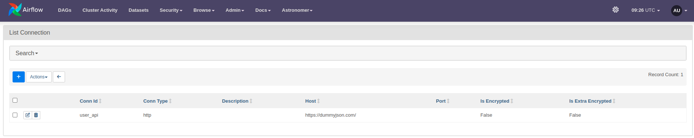
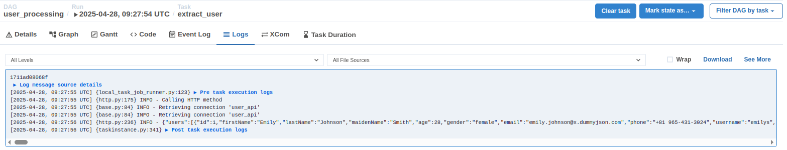

## Overview

This guide covers:

- How to create an `http connection` in Airflow
- Using that connection in an `http operator` to fetch data from a REST API

## 1. Create an HTTP connection

Go to the web interface under `Admin > Connections` and select `Add a new record`:

Fill in the HTTP connection details as follows:

```
- conn_id: user_api
  conn_type: http
  conn_host: https://dummyjson.com/
  conn_schema:
  conn_login:
  conn_password:
  conn_port:
  conn_extra:
```

The result should look like this:



## 2. Create an HTTP operator

Declare the DAG and HTTP operator as shown in the file [user_processing.py](user_processing.py). Note that `http_conn_id='user_api'`
corresponds to the `conn_id` set in the connection creation step above.

Next, add this file to the `dags` directory and enable it in the UI, similar to the `hello-airflow` exercise.

In the logs of the task instance, you will see the response printed as follows:

