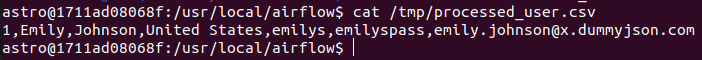

## Overview

This section guides you through declaring tasks using the `PythonOperator`.

The `PythonOperator` allows you to declare a task that executes a Python function you define.

## 1. Declare a task

We will declare the `process_user` task, which calls the `_process_user` function to process the response returned by the REST API. The processed result is saved to a `.csv` file.

See the result in the `user_processing.py` file.

**Note:** You may wonder about the code snippet `ti.xcom_pull(task_ids="extract_user")`. This relates to the concept of `XComs`, which we will cover in a later section.

Next, overwrite this file in the `dags` directory and enable the DAG in the web UI.

## 2. Check the result

Check the result in the `.csv` file.

Exec into the `airflow-scheduler` container:

**Note:** Replace the container name with the corresponding container on your machine.

```
docker exec -ti airflow-airflow-worker-1 bash
```

View the contents of the `.csv` file:

```
cat /tmp/processed_user.csv
```

The result should look like this:



## 3. Exercise

Modify the `_process_user` function to process the full list of users returned instead of only the first user.

Check the result in the generated `.csv` file.