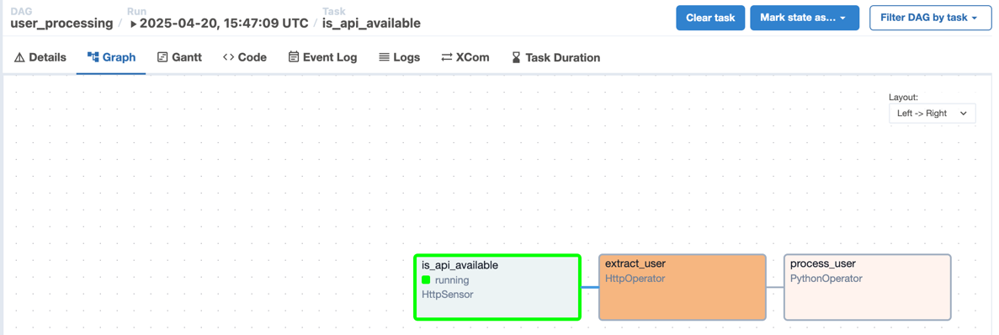

## Overview

In this section, we will add an HTTP sensor. This sensor checks whether the REST API is available before proceeding to subsequent steps.

## 1. Declare the sensor

Add the `http sensor` as shown in the `user_processing.py` file.

Next, overwrite this file in the `dags` directory and enable the DAG in the web UI.

## 2. Verify

We can see that the DAG still runs correctly and writes results to the `.csv` file, just as in the previous section — because the `users/` endpoint set in `HttpSensor` is valid.

Now try changing the `users` endpoint to an invalid one (e.g., `users1`) in `HttpSensor`. Then observe the change in the web UI. You will see that `HttpSensor` stays in a `running` state because it continuously checks whether the endpoint is available. Subsequent tasks such as `extract_user` and `process_user` will not be executed.

