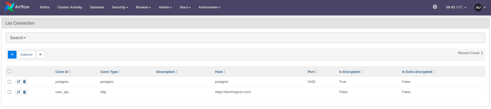
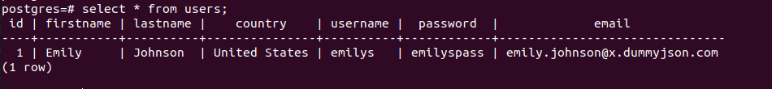

## Overview

In this section, we will use `PostgresHook` to load data from a `.csv` file into a table in the Postgres database.

## 1. Create a Postgres connection

Go to the web interface under `Admin > Connections` and select `Add a new record`:

Declare the Postgres database connection as follows:

```
- conn_id: postgres
  conn_type: postgres
  conn_host: postgres
  conn_schema:
  conn_login: airflow
  conn_password: airflow
  conn_port: 5432
  conn_extra:
```

The result should look like this:



## 2. Declare the table creation task

Next, declare the `create_table` task using `SQLExecuteQueryOperator`. This task will execute the SQL statement to create the table.

See `user_processing.py`.

## 3. Declare the data loading task

Next, declare the `store_user` task using `PostgresHook`. This task will load data from the `.csv` file into the `users` table created in the `create_table` task.

See `user_processing.py`.

## 4. Declare and enable the DAG in the UI

Overwrite the `user_processing.py` file in the `dags` directory and enable the DAG in the web UI.

Run the DAG from the UI.

## 5. Check the result

After the DAG runs successfully, the `users` table will be created in the database and data will be loaded from the `.csv` file into this table.

To verify the data in the `users` table in the Postgres database, run the following commands:

Exec into the `postgres` container:

**Note:** Replace the container name with the corresponding container on your machine.

```
docker exec -ti airflow-postgres-1 bash
```

Next, connect to the database using `psql`:

```
psql -U airflow -d airflow
```

Query the users table:

```
select * from users;
```



## Conclusion

Congratulations! After completing this section, you have successfully created and run a data pipeline on `airflow`.
