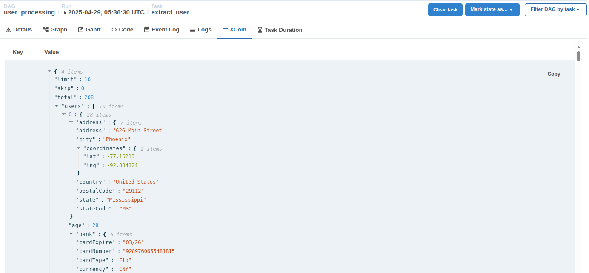

## Overview

In the `user_processing` pipeline, we used the code `ti.xcom_pull(task_ids="extract_user")`. This function pulls data from XComs. Essentially, XComs act as a communication channel for passing data between Airflow tasks.

In this section, we will practice XComs by rewriting the `extract_user` task in `user_processing`. Instead of using `HttpOperator`, we will rewrite it using `PythonOperator` combined with XComs.

## 1. Rewrite the `extract_user` task

We will rewrite the `extract_user` task using `PythonOperator`:

- Use the `requests` library to call the REST API.
- Use XComs to pass the REST API response from the `extract_user` task to the `process_user` task via push/pull.

## 2. Declare and enable the DAG in the UI

Overwrite the `user_processing.py` file in the `dags` directory and enable the DAG in the web UI.

Run the DAG from the UI.

## 3. Check the result

You will see that the pipeline still runs successfully as in previous sections.

In the `XCom` section of the `extract_user` task in the web UI, you will see the REST API response data stored at the key `users`.

