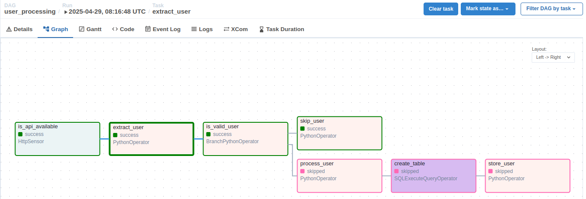
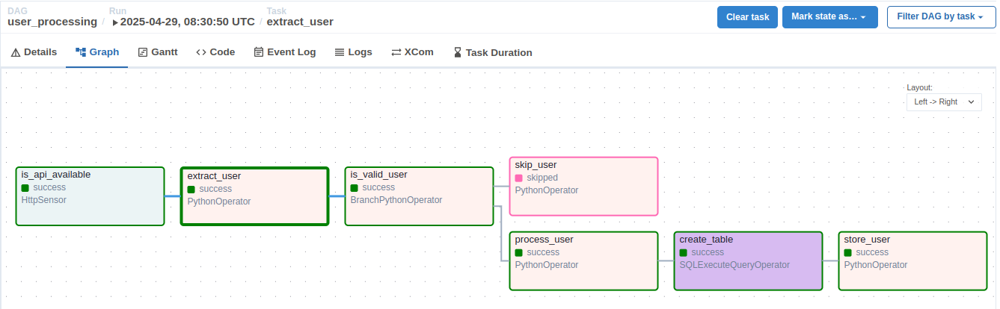

## Overview

In previous sections, we saw that by default all tasks in a DAG are executed.

In this section, we will use `branching` to conditionally execute tasks (choosing one or more branches instead of executing all of them).

## 1. Add `branching` to the `user_processing` DAG

We will modify the logic of `user_processing` as follows:

- The `extract_user` task will randomly select a user from the returned list and push that user to XCom.
- Add the `is_valid_user` task to check the user's age. If the user is older than 30, they will be skipped; otherwise, the processing logic from previous sections will apply.

## 2. Declare and enable the DAG in the UI

Overwrite the `user_processing.py` file in the `dags` directory and enable the DAG in the web UI.

Run the DAG from the UI.

## 3. Check the result

Run the DAG multiple times and you will see that the pipeline result depends on the user retrieved in the extract step.

When the user is older than 30:

Otherwise:

