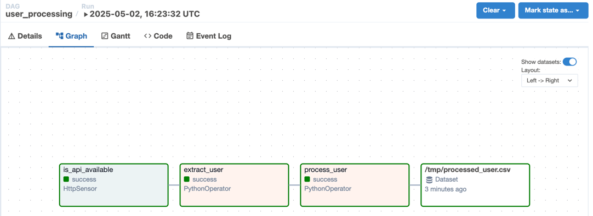
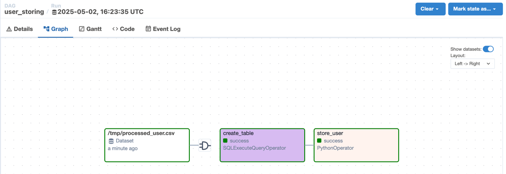

## Overview

In this section, we will use `datasets` to split the `user_processing` DAG into two DAGs:

- The first DAG will extract and process users, then update the dataset.
- The second DAG will listen for changes on the dataset and store the data in the database.

## 1. Declare the `user_processing` DAG

We will update the `user_processing` DAG to perform the following tasks:

- Fetch data from the REST API.
- Process the data and save it to a `.csv` file (dataset).

## 2. Declare the `user_storing` DAG

This DAG will listen for changes on the dataset (the `.csv` file) and perform the following tasks:

- Create the `users` table in the database.
- Store the data into the `users` table.

## 3. Declare and enable the DAGs in the UI

Overwrite the `user_processing.py` file and copy the `user_storing` file to the `dags` directory. Then enable both DAGs in the web UI.

Run the DAGs from the UI.

## 4. Check the result

You will see both DAGs run successfully with the following graph views:

Result for the `user_processing` DAG:

Result for the `user_storing` DAG:

## 5. Exercise

Add a `user_reporting` DAG that performs the following tasks:

- Listens for changes on the `users` table dataset.
- Creates the `user_reports` table.
- Queries the `users` table and saves the report to the `user_reports` table.

The `user_reports` table stores the number of users by gender. For example:

| gender | num_users |
|--------|-----------|
| female | 6         |
| male   | 4         |
