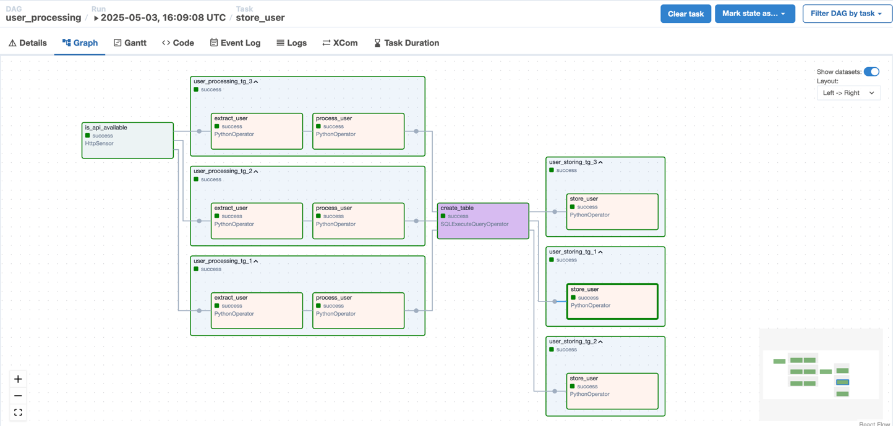
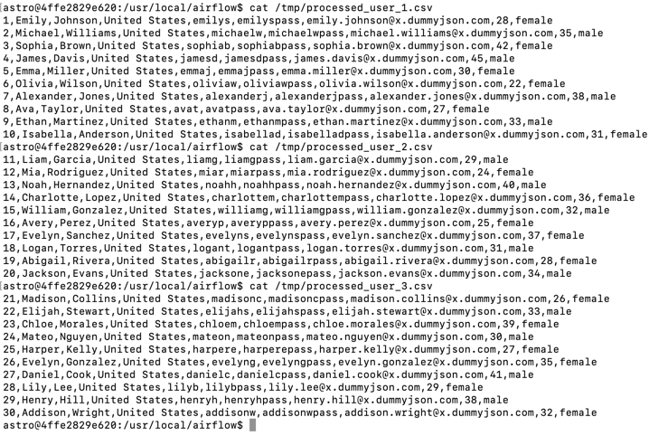
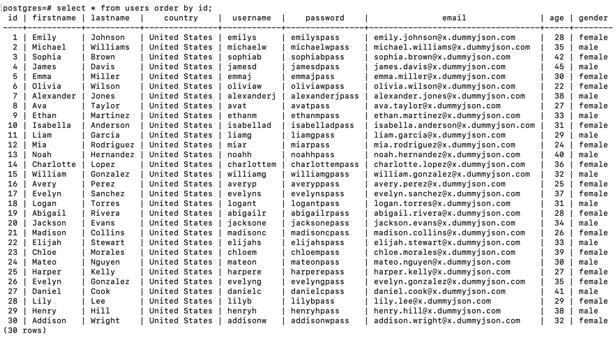

## Overview

In this section, we will use the `task_groups` technique in the `user_processing` DAG to handle fetching data from multiple pages of the get-users API.

## 1. Update the `user_processing` DAG

We will update the `user_processing` DAG to address the following requirements:

- Fetch data from multiple pages of the get-users API.
- For each page, process the data and save it to a separate `.csv` file.
- Load all generated `.csv` files into the `users` table.

## 2. Declare and enable the DAG in the UI

Overwrite the `user_processing.py` file in the `dags` directory. Then enable the DAG in the web UI.

Run the DAG from the UI.
    
## 3. Check the result

You will see the new DAG with a graph view like this:

We have successfully created 3 task groups corresponding to 3 pages for each of the `user_processing` and `user_storing` sections.

Checking the `.csv` files, you will see 3 files corresponding to the 3 pages:

The result in the `users` table also shows that data has been inserted from all 3 pages:

## 4. Exercise

Using the `task_group` and `datasets` techniques, split the `user_processing` DAG above into two separate DAGs — `user_processing` and `user_storing` (as in [09-datasets](../09-datasets)) — to process data across 3 pages of the get-users API.