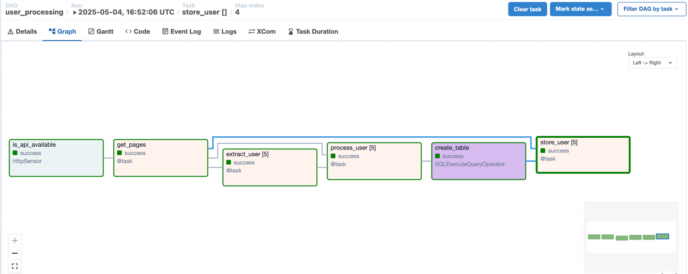
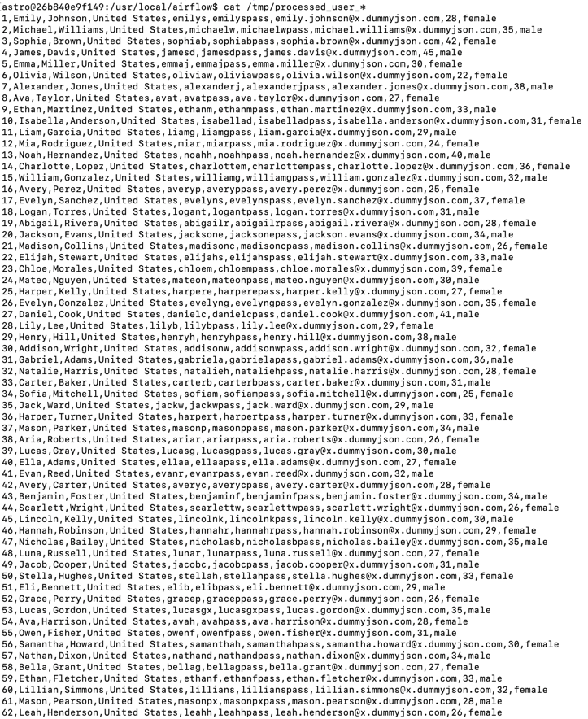
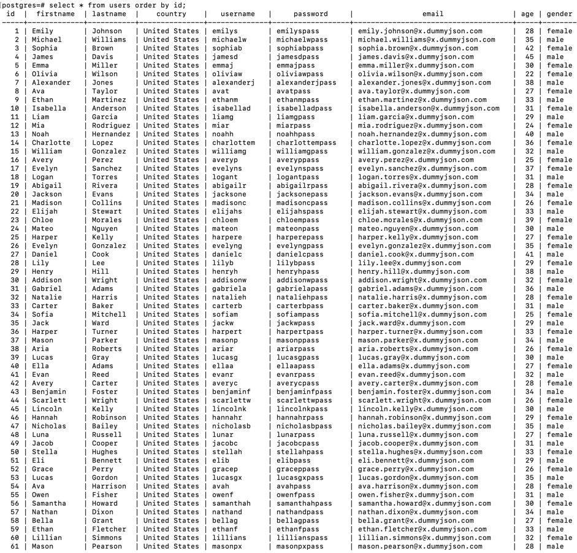

## Overview

In this section, we will apply the `dynamic-task-mapping` technique to write tasks for processing and storing users across multiple pages of the get-users API.

We will also declare DAGs and tasks using `@dag` and `@task` decorators.

## 1. Update the `user_processing` DAG

We will update the `user_processing` DAG to handle the following logic:

- Retrieve the number of pages from the get-users API.
- Based on the number of pages, dynamically create the corresponding number of tasks using the `dynamic-task-mapping` technique:
    + A task to process users on one page and save to a `.csv` file.
    + A task to load the `.csv` file and store data into the `users` table.

## 2. Declare and enable the DAG in the UI

Overwrite the `user_processing.py` file in the `dags` directory. Then enable the DAG in the web UI.

Run the DAG from the UI.

## 3. Check the result

You will see the new DAG with a graph view like this:

We have successfully created a dynamic number of tasks based on the number of pages returned by the API using the `dynamic-task-mapping` technique.

Checking the `.csv` files, you will see files corresponding to each page:

The result in the `users` table also shows that data has been inserted from all pages:

