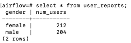

## Overview

In this section, we will write a plugin and use it inside a DAG.

## 1. Write the `user_report_hook` plugin

`user_report_hook` is a simple plugin that declares `UserReportHook`. This hook contains a `report` function that creates the `user_reports` table and inserts data into it using the `psycopg` library to communicate with Postgres.

Next, create the directory structure and copy the `user_report_hook.py` file to the [plugins](../00-setup/airflow/plugins) directory following this structure: `plugins/hooks/user/user_report_hook.py`.

## 2. Use the hook in a DAG

The `user_reporting` DAG will import `UserReportHook` and call the `report` function inside a task.

## 3. Declare and enable the DAG in the UI

Overwrite the `user_processing.py` file in the `dags` directory. Then enable the DAG in the web UI.

Run the DAG from the UI.

## 4. Check the result

The result in the `user_reports` table shows that the table has been created and data has been inserted:

