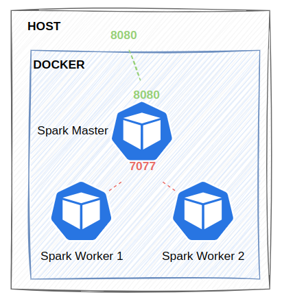

## Overview

This guide helps you set up a Spark cluster with 1 master and 2 workers using Docker, with the following architecture:



## 1. Create network

```shell
docker network create streaming-network --driver bridge
```

## 2. Run spark

**Start spark**

Firstly, build a custom image using Dockerfile

```shell
docker build -t unigap/spark:3.5 .
```

Then creating `spark_data` and `spark_lib` volume

```shell
docker volume create spark_data
docker volume create spark_lib
```

Start spark using compose file

```shell
docker compose up -d
```

## Monitor

[spark master](http://localhost:8080)

## References

[Setup Spark Cluster on Docker](https://github.com/bitnami/containers/tree/main/bitnami/spark#how-to-use-this-image)