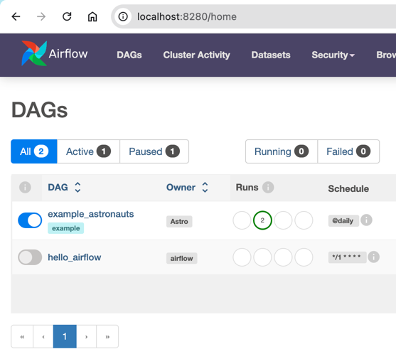

## Overview

Hướng dẫn cách tạo và chạy một dag đơn giản trên `airflow`

## 1. Thêm file .py vào thư mục `dags`

Copy file `hello_airflow.py` vào thư mục `dags` trong `airflow` mà bạn đã cài đặt được.

## 2. Bật dag trên giao diện

Sau khi add file `.py` vào thư mục `dags`, bạn vào giao diện của airflow và thấy `hello_airflow` đã được cập nhật
vào danh sách dags

Tiếp theo hãy bật dag `hello_airflow` lên và quan sát ...