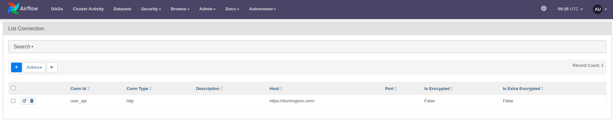
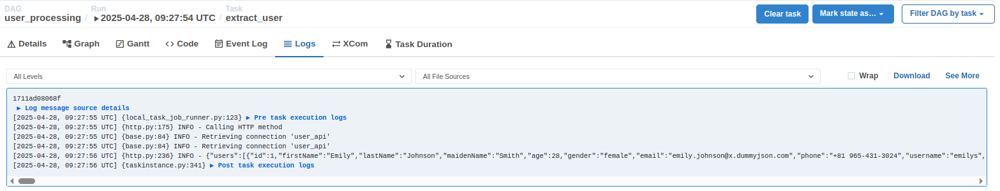

## Overview

Phần hướng dẫn này bao gồm:

- Cách tạo một `http connection` trên airflow
- Sử dụng connection này trong `http operator` để get dữ liệu từ một rest api

## 1. Tạo http connection

Truy cập vào web interface mục `Admin > Connections` chọn `Add a new record`:

Điền thông tin http connection như sau:

```
- conn_id: user_api
  conn_type: http
  conn_host: https://dummyjson.com/
  conn_schema:
  conn_login:
  conn_password:
  conn_port:
  conn_extra:
```

Kết quả thu được như sau:



## 2. Tạo http operator

Khai báo dag và http operator như trong file [user_processing.py](user_processing.py). Lưu ý ` http_conn_id='user_api'`
chính là `conn_id` đã set ở bước tạo connection

Tiếp theo bạn thêm file này vào trong thư mục `dags` và bật trên giao diện tương tự như bài tập `hello-airflow`.

Tại phần logs của task instance, bạn sẽ thấy response được in ra như sau:

