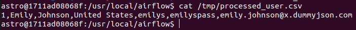

## Overview

Phần này hướng dẫn bạn khai báo task bằng việc sử dụng `PythonOperator`.

`PythonOperator` giúp bạn khai báo 1 task và task này sẽ thực thi một hàm mà bạn define trong python.

## 1. Khai báo task

Chúng ta sẽ khai báo task `process_user`, task này sẽ gọi hàm `_process_user` để xử lý response trả về của rest api. Kết
quả xử lý được lưu xuống file `.csv`.

Kết quả như trong file `user_processing.py`.

**Lưu ý:** Có thể bạn sẽ thắc mắc đoạn code `ti.xcom_pull(task_ids="extract_user")`. Đây là khái niệm về `Xcoms` và
chúng ta sẽ tìm hiểu ở phần sau nha!

Tiếp theo bạn ghi đè (overwrite) file này vào trong thư mục `dags` và bật dag này trên giao diện web.

## 2. Kiểm tra kết quả

Kiểm tra kết quả trong file `.csv`.

Exec vào trong `airflow-scheduler` container

**Lưu ý:** thay container's name bằng container tương ứng trên máy của bạn.

```
docker exec -ti airflow-airflow-worker-1 bash
```

Xem nội dung file `.csv`

```
cat /tmp/processed_user.csv
```

Kết quả như sau:



## 3. Yêu cầu

Sửa hàm `_process_user` để xử lý toàn bộ danh sách users trả về thay vì chỉ xử lý user đầu tiên.

Kiểm tra kết quả trong file `.csv` thu được.