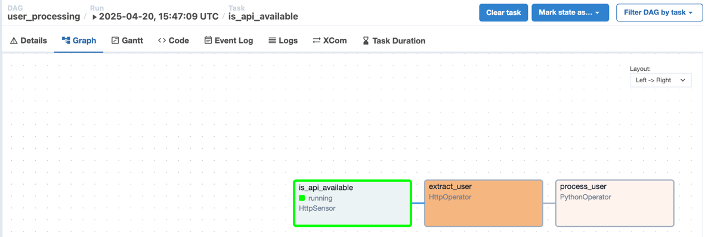

## Overview

Trong phần này, chúng ta sẽ bổ sung thêm http sensor. Sensor này có vai trò kiểm tra xem rest api có hoạt động không
trước khi xử lý các bước tiếp theo.

## 1. Khai báo sensor

Khai báo thêm `http sensor` như trong file `user_processing.py`.

Tiếp theo bạn ghi đè (overwrite) file này vào trong thư mục `dags` và bật dag này trên giao diện web.

## 2. Kiểm tra

Chúng ta thấy dag vẫn sẽ chạy đúng và ghi kết quả ra file `.csv` giống như trong phần trước. Bới vì endpoint `users/` set
trong `HttpSensor` đang hợp lệ.

Bây giờ bạn hãy thử đổi endpoint `users` thành endpoint không hợp lệ (vd: `users1`) trong `HttpSensor`. Sau đó quan sát sự
thay đổi trên giao diện web. Bạn sẽ thấy `HttpSensor` sẽ ở trạng thái `running` vì nó liên tục check xem endpoint có
available không. Và các task phía sau như `extract_user` và `process_user` sẽ không được chạy.

