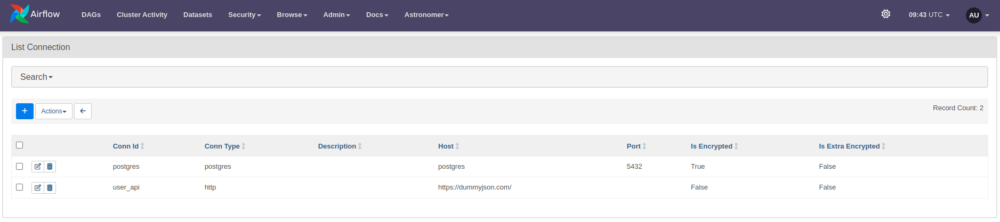
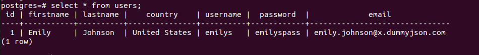

## Overview

Trong phần này, chúng ta sẽ sử dụng `PostgresHook` để load data trong file `.csv` vào bảng trong db postgres

## 1. Tạo postgres connection


Truy cập vào web interface mục `Admin > Connections` chọn `Add a new record`:

Bạn khai báo connection của db postgres như sau:

```
- conn_id: postgres
  conn_type: postgres
  conn_host: postgres
  conn_schema:
  conn_login: airflow
  conn_password: airflow
  conn_port: 5432
  conn_extra:
```

Kết quả như sau:



## 2. Khai báo task tạo bảng

Tiếp theo, chúng ta khai báo task `create_table` sử dụng `SQLExecuteQueryOperator`. Task này sẽ thực thi câu lệnh sql
tạo bảng.

Xem trong file `user_processing.py`.

## 3. Khai báo task load data vào bảng

Tiếp theo, khai báo task `store_user` sử dụng `PostgresHook`. Task này sẽ load data trong file `.csv` vào bảng `users`
đã tạo được ở task `create_table`.

Xem trong file `user_processing.py`.

## 4. Khai báo và bật dag trên giao diện

Ghi đè (overwrite) file `user_processing.py` vào trong thư mục `dags` và bật dag này trên giao diện web.

Thực hiện chạy dag trên giao diện.

## 5. Kiểm tra kết quả

Sau khi dag chạy thành công, bảng `users` sẽ được tạo trong db và dữ liệu sẽ được load từ file `.csv` vào bảng này.

Để kiểm tra dữ liệu trong bảng `users` của db postgres, chạy các lệnh sau:

Exec vào trong `postgres` container

**Lưu ý: ** thay tên container bằng container trên máy của bạn

```
docker exec -ti airflow-postgres-1 bash
```

Tiếp theo, connect db sử dụng `psql`

```
psql -U airflow -d airflow
```

Truy vấn bảng users

```
select * from users;
```



## Kết luận

Chúc mừng bạn, vậy là sau phần này bạn đã tạo và chạy thành công 1 data pipeline trên `airflow`.
