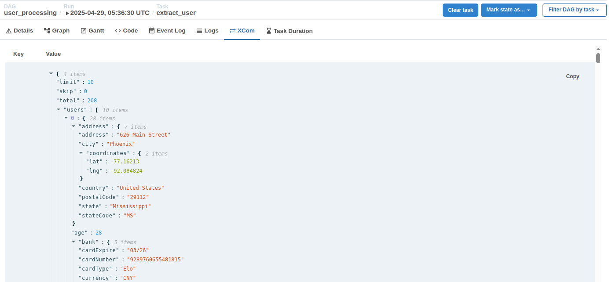

## Overview

Trong phần pipeline `user_processing`, chúng ta có sử dụng đoạn code `ti.xcom_pull(task_ids="extract_user")`. Hàm này
thực hiện pull dữ liệu từ XComs ra. Về cơ bản XComs giống như kênh giao tiếp và truyền tải dữ liệu giữa các tasks của
airlfow.

Phần này chúng ta sẽ thực hành về XComs bằng việc viết lại task `extract_user` của `user_processing`. Thay vì sử
dụng `HttpOperator` thì chúng ta sẽ tự viết lại bằng `PythonOpertor` kết hợp với XComs.

## 1. Viết lại task `extract_user`

Chúng ta sẽ viết lại task `extract_user` bằng `PythonOperator`

- Sử dụng thư viện `requests` để call rest api
- Sử dụng XComs để gửi response của rest api từ task `extract_user` sang task `process_user` thông qua push/pull

## 2. Khai báo và bật dag trên giao diện

Ghi đè (overwrite) file `user_processing.py` vào trong thư mục `dags` và bật dag này trên giao diện web.

Thực hiện chạy dag trên giao diện.

## 3. Kiểm tra kết quả

Bạn sẽ thấy kết quả pipeline vẫn chạy thành công như các phần trước.

Tại task `extract_user` phần `XCom` trên giao diện web, bạn sẽ thấy dữ liệu response của rest api được lưu tại
key `users`

