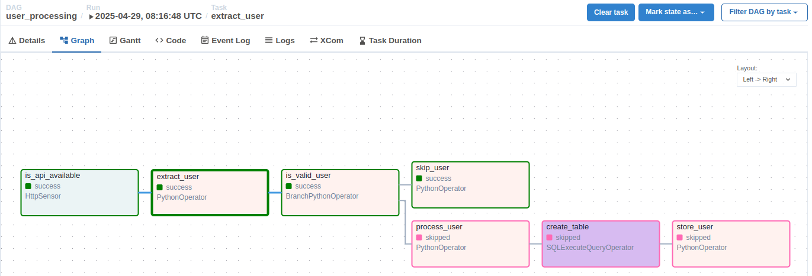
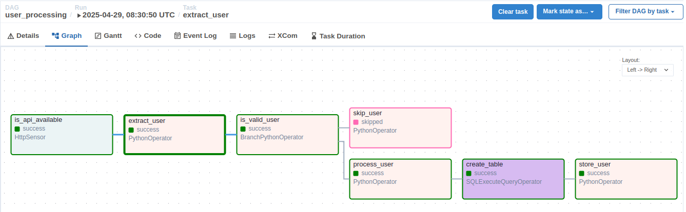

## Overview

Trong các phần trước, chúng ta thấy mặc định tất cả các tasks trong dag đều được thực thi.

Phần này, chúng ta sẽ sử dụng kỹ thuật `branching` để rẽ nhánh việc thực thi tasks (chọn 1 hoặc nhiều nhánh thay vì thực
thi toàn bộ).

## 1. Bổ sung `branching` vào `user_processing` dag

Ta sẽ sửa logic của `user_processing` như sau:

- Task `extract_user` sẽ lấy 1 user ở vị trí ngẫu nhiên trong danh sách user trả về và push user này vào XCom
- Thêm task `is_valid_user` để kiểm tra tuổi của user. Nếu user có tuổi > 30 thì sẽ được bỏ qua không xử lý, còn lại sẽ
  xử lý như logic của các phần trước

## 2. Khai báo và bật dag trên giao diện

Ghi đè (overwrite) file `user_processing.py` vào trong thư mục `dags` và bật dag này trên giao diện web.

Thực hiện chạy dag trên giao diện.

## 3. Kiểm tra kết quả

Thực hiện chạy dag nhiều lần, bạn sẽ thấy kết quả pipeline chạy sẽ phụ thuộc vào user thu được ở bước extract.

Trường hợp user có tuổi > 30:

Trường hợp còn lại:

