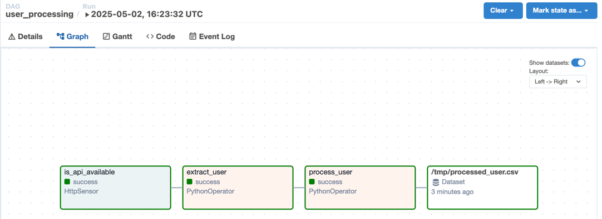
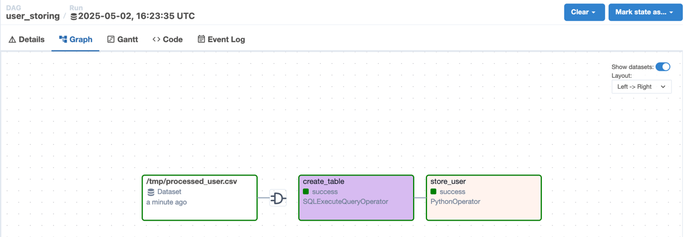

## Overview

Trong phần này, chúng ta sẽ sử dụng `datasets` để chia `user_processing` dag thành 2 dag:

- DAG thứ nhất sẽ extract, process user và cập nhật vào datasets
- DAG thứ 2 sẽ lắng nghe thay đổi trên dataset và thực hiện lưu trữ vào trong database

## 1. Khai báo dag `user_processing`

Chúng ta sẽ sửa lại dag `user_processing` để thực hiện các task vụ sau:

- Get dữ liệu từ rest api
- Xử lý dữ liệu và lưu xuống file `.csv` (datasets)

## 2. Khai báo dag `user_storing`

Dag này sẽ lắng nghe thay đổi trên datasets (file `.csv`) và thực hiện các task vụ sau:

- Tạo bảng `users` trong database
- Lưu trữ dữ liệu vào bảng `users`

## 3. Khai báo và bật dag trên giao diện

Ghi đè (overwrite) file `user_processing.py` và copy file `user_stroing` vào trong thư mục `dags`. Tiếp theo, bật 2 dags
này trên giao diện web.

Thực hiện chạy dag trên giao diện.

## 4. Kiểm tra kết quả

Bạn sẽ thấy 2 dags chạy thành công và có giao diện graph như sau:

Kết quả dag `user_processing`:

dag `user_storing`:

## 5. Yêu cầu

Hãy thêm 1 dag `user_reporting` thực hiện nhiệm vụ sau:

- Lắng nghe thay đổi trên datasets table `users`
- Thực hiện tạo bảng `user_reports`
- Truy vấn bảng `users` và lưu report vào bảng `user_reports`

Bảng `user_reports` lưu thông tin số người dùng theo giới tính. Ví dụ:

| gender | num_users |
|--------|-----------|
| female | 6         |
| male   | 4         |
