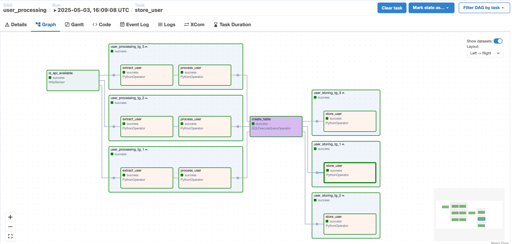
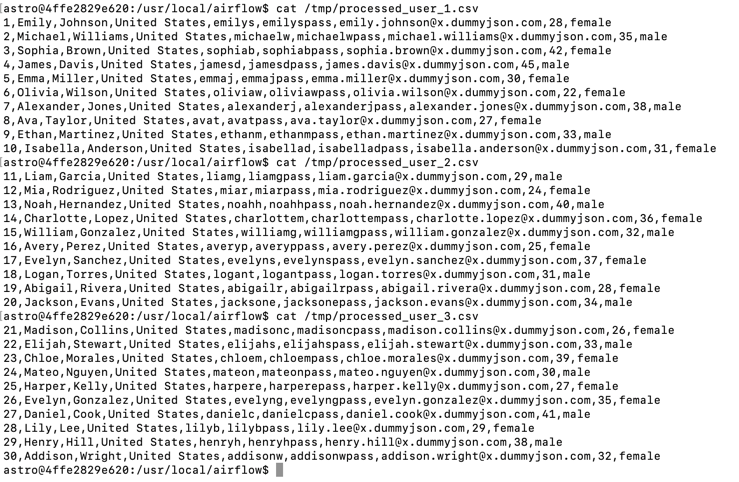
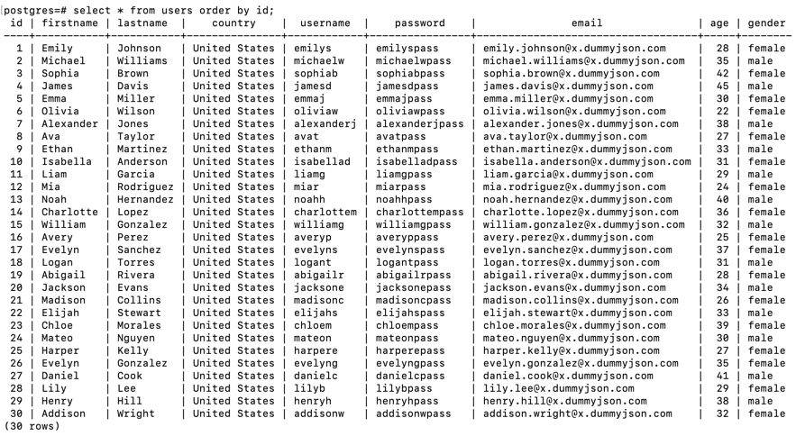

## Overview

Trong phần này, chúng ta sẽ sử dụng kỹ thuật `task_groups` trong dag `user_processing` để xử lý lấy dữ liệu trên nhiều
pages của api get users.

## 1. Sửa lại dag `user_processing`

Chúng ta sẽ sửa lại dag `user_processing` để giải quyết các yêu cầu sau:

- Get dữ liệu từ nhiều pages của api get users
- Với mỗi page sẽ xử lý và lưu xuống 1 file `.csv`
- Load các file `.csv` đã tạo vào bảng `users`

## 2. Khai báo và bật dag trên giao diện

Ghi đè (overwrite) file `user_processing.py` vào trong thư mục `dags`. Tiếp theo, bật dag này trên giao diện web.

Thực hiện chạy dag trên giao diện.
    
## 3. Kiểm tra kết quả

Bạn sẽ thấy dag mới có giao diện graph như sau:

Như vậy là chúng ta đã tạo thành công 3 task_group tương ứng cho 3 page của từng phần `user_processing` cũng
như `user_storing`.

Kiểm tra file `.csv` sẽ thấy có 3 file tương ứng với 3 pages:

Kết quả trong bảng `users` cũng cho thấy dữ liệu được insert đủ 3 pages:

## 4. Yêu cầu

Sử dụng kỹ thuật `task_group` và `datasets`, hãy tách dag `user_processing` trong phần trên thành 2 dags riêng
biệt `user_processing` và `user_storing` (như trong bài [09-datasets](../09-datasets)) để xử lý dữ liệu trên 3 pages của
api get users.