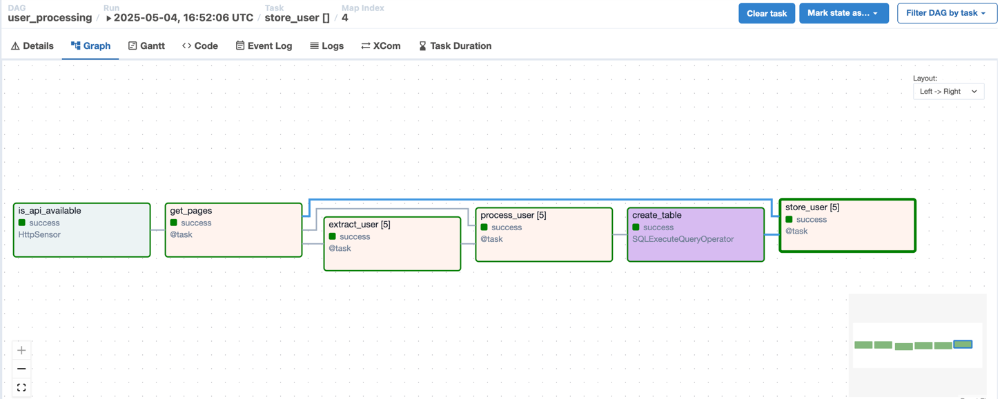
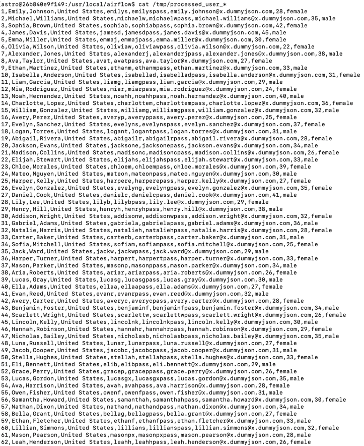
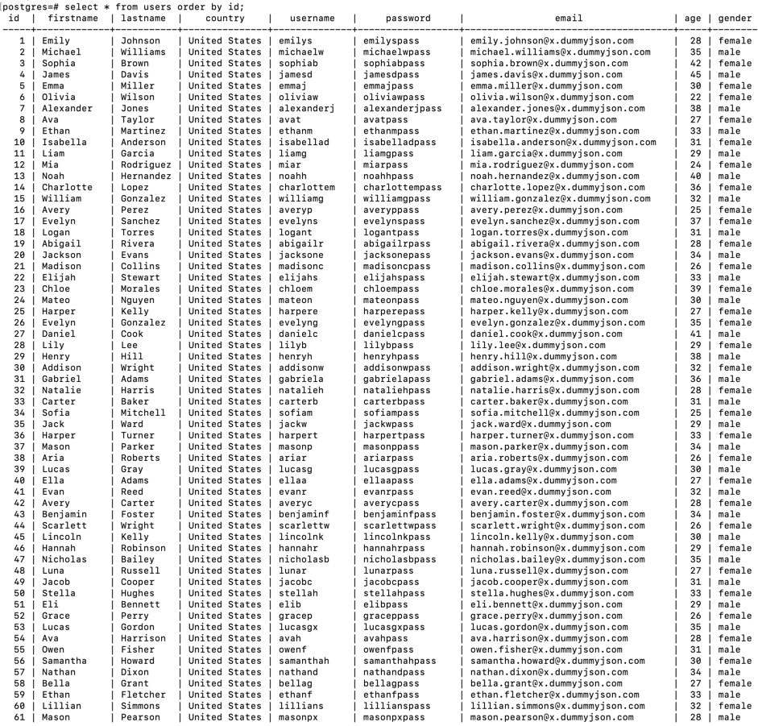

## Overview

Trong phần này, chúng ta sẽ ứng dụng kỹ thuật `dynamic-task-mapping` để viết các task cho việc xử lý và lưu trữ users
trên nhiều page của api get users.

Chúng ta cũng sẽ khai báo dag và task bằng việc sử dụng `@dag` và `@task` decorators.

## 1. Sửa lại dag `user_processing`

Chúng ta sẽ cập nhật lại dag `user_processing` để xử lý các logic sau:

- Lấy số lượng pages từ api get users
- Từ số lượng pages thu được tạo số task tương ứng bằng kỹ thuật `dynamic-task-mapping`:
    + Task xử lý user trên 1 page và lưu ra file `.csv`
    + Task load file `.csv` và lưu vào bảng `users`

## 2. Khai báo và bật dag trên giao diện

Ghi đè (overwrite) file `user_processing.py` vào trong thư mục `dags`. Tiếp theo, bật dag này trên giao diện web.

Thực hiện chạy dag trên giao diện.

## 3. Kiểm tra kết quả

Bạn sẽ thấy dag mới có giao diện graph như sau:

Như vậy là chúng ta đã tạo thành công số lượng tasks động theo số lượng pages trả về ở api thông qua việc sử dụng kỹ
thuật `dynamic-task-mapping`.

Kiểm tra file `.csv` sẽ thấy có các files tương ứng với các pages:

Kết quả trong bảng `users` cũng cho thấy dữ liệu được insert đủ trên các pages:

