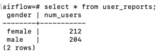

## Overview

Trong phần này, chúng ta sẽ thử viết 1 plugin và sử dụng plugin này trong dag.

## 1. Viết plugin `user_report_hook`

`user_report_hook` viết 1 plugin đơn giản trong đó khai báo `UserReportHook`. Hook này chứa hàm `report` sẽ tạo
bảng `user_reports` và insert dữ liệu vào bảng này thông qua việc thử sụng thư viện `psycopg` để giao tiếp với postgres.

Tiếp theo tạo cấu trúc thư mục và copy file `user_report_hook.py` vào trong thư
mục [plugins](../00-setup/airflow/plugins) theo cấu trúc như sau: `plugins/hooks/user/user_report_hook.py`

## 2. Sử dụng hook trong dag

Dag `user_reporting` sẽ import `UserReportHook` và gọi hàm `report` trong task.

## 3. Khai báo và bật dag trên giao diện

Ghi đè (overwrite) file `user_processing.py` vào trong thư mục `dags`. Tiếp theo, bật dag này trên giao diện web.

Thực hiện chạy dag trên giao diện.

## 4. Kiểm tra kết quả

Kết quả trong bảng `user_reports` cho thấy bảng đã được tạo và dữ liệu được insert:

