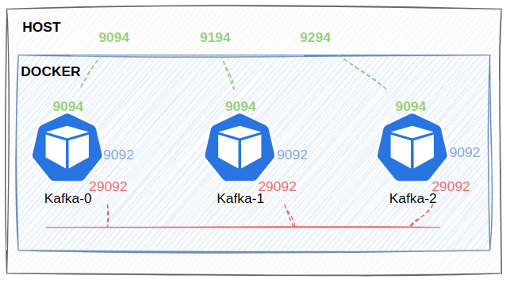

## Overview

Hướng dẫn này giúp bạn cài đặt một cụm Kafka gồm 3 nodes sử dụng docker có mô hình như sau:



## 1. Create network

```shell
docker network create streaming-network --driver bridge
```

## 2. Run kafka

```shell
docker compose up -d
```

**Check Status & Logs**

```shell
docker compose ps
docker compose logs kafka-0 -f -n 100
```

**Testing**

Run inside kafka's containers

```shell
docker exec -ti kafka-0 bash
```

Producer without key

```shell
kafka-console-producer --producer.config /etc/kafka/producer.properties --bootstrap-server kafka-0:29092,kafka-1:29092,kafka-2:29092 --topic test
```
Producer with key
```shell
kafka-console-producer --producer.config /etc/kafka/producer.properties --bootstrap-server kafka-0:29092,kafka-1:29092,kafka-2:29092 --topic test --property "parse.key=true" --property "key.separator=:"
```
Consumer

```shell
kafka-console-consumer --consumer.config /etc/kafka/consumer.properties --bootstrap-server kafka-0:29092,kafka-1:29092,kafka-2:29092 --topic test --from-beginning
```

**Some CLI commands tutorials**

Step 1.  Create a file named `client.properties` with the following content:
```
security.protocol=SASL_PLAINTEXT
sasl.mechanism=PLAIN
sasl.jaas.config=org.apache.kafka.common.security.plain.PlainLoginModule required username="kafka" password="UnigapKafka@2024";
```

Step 2. Copy the file to the Kafka container:
```
docker cp client.properties kafka-0:/tmp/client.properties
```

Step 3. Create a topic with authentication
```
docker exec kafka-0 kafka-topics \
  --bootstrap-server kafka-0:9092 \
  --topic FirstTopic \
  --create \
  --partitions 3 \
  --replication-factor 3 \
  --command-config /tmp/client.properties
```

Step 3 (optional). Enter the Docker env
```
docker exec -ti kafka-0 bash
```
then create topic with authentication
```
kafka-topics \
  --bootstrap-server kafka-0:9092 \
  --topic FirstTopic \
  --create \
  --partitions 3 \
  --replication-factor 3 \
  --command-config /tmp/client.properties
```

Step 4. List topics with authentication
```
kafka-topics \
  --bootstrap-server kafka-0:9092 \
  --list \
  --command-config /tmp/client.properties
```

Step 5. Describe a topic with authentication
```
kafka-topics \
  --bootstrap-server kafka-0:9092 \
  --describe \
  --topic FirstTopic \
  --command-config /tmp/client.properties
```

Step 6. Delete a topic with authentication
```
kafka-topics \
  --bootstrap-server kafka-0:9092 \
  --delete \
  --topic FirstTopic \
  --command-config /tmp/client.properties
```

## 3. Monitor

[akqh](http://localhost:8180)

## References

[Quick Start for Confluent Platform](https://docs.confluent.io/platform/current/platform-quickstart.html#quick-start-for-cp)

[Docker Image Reference for Confluent Platform](https://docs.confluent.io/platform/current/installation/docker/image-reference.html#docker-image-reference-for-cp)

[akhq configuration](https://akhq.io/docs/configuration/brokers.html)

[Docker Image Configuration Reference for Confluent Platform](https://docs.confluent.io/platform/current/installation/docker/config-reference.html)
